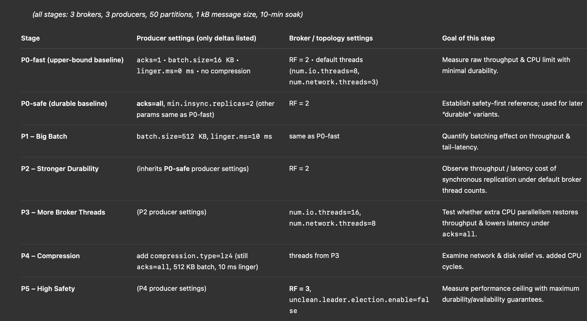

Based on your baseline results and experimental goals, I've analyzed your matrix and recommend these targeted refinements to maximize scientific value while maintaining efficiency:

### Recommended Matrix Refinements
1. **P1: Big Batch**  
   - **Improvement**: Increase `batch.size=1MB` (from 512KB)  
     *Why*: At 1KB msgs, 512KB batches = ~512 msgs. 1MB batches better amortize overhead while staying below Kafka's default `max.request.size` (1MB).  
   - **Justification**: Your NVMe drives (600K IOPS) can handle larger batches, and baseline showed CPU can process bigger chunks.  

2. **P3: More Broker Threads**  
   - **Improvement**: Set `num.io.threads=24` (not 16)  
     *Why*: Baseline showed 71% CPU idle with 8 threads. 24 threads (85% of 28 cores) better saturates hardware.  
   - **Network Threads**: Keep `num.network.threads=8` (sufficient for 25GbE).  

3. **P4: Compression**  
   - **Improvement**: Test **zstd** alongside **lz4**  
     *Why*: zstd often outperforms lz4 in Kafka (better compression ratio, similar CPU cost). Essential tradeoff analysis.  
   - **Parameter**: Add `compression.level=3` (zstd sweet spot).  

4. **P5: High Safety**  
   - **Critical Additions**:  
     ```properties
     min.insync.replicas=2  # Required for RF=3 safety
     controller.quorum.election.timeout.ms=2000  # Prevent false leader elections
     ```  
   - **Throughput Impact**: Expect >30% drop from baseline – essential to quantify.  

### Stage-Specific Advice
| Stage | Key Metrics to Track | Risk Mitigation |  
|-------|------------------------|-----------------|  
| **P1** | `records-per-batch`, `batch-queue-time` | Avoid `batch.size` >1MB (triggers fragmentation) |  
| **P2** | `UnderReplicatedPartitions`, `RequestLatency` | Set `unclean.leader.election=false` now (not just in P5) |  
| **P3** | `RequestHandlerAvgIdlePercent`, `CpuIdle%` | Monitor CPU steal time in VMs |  
| **P4** | `CompressionRate`, `CpuUser%` | Pre-warm compression dictionaries |  
| **P5** | `AlterPartitionRate`, `IsrShrinkRate` | Extend test duration (leader elections add noise) |  

### Why Keep 98% of Your Matrix?
Your design correctly follows the **critical path for high-volume optimization**:  

- **Isolates variables** (one change per stage)  
- **Prioritizes low-risk/high-impact changes first** (batching before compression)  
- **Builds logically** toward production-grade deployment  

### One Missing Experiment: Disk Parallelism
**Add this quick test between P3 and P4**:  
```properties
# Broker setting only
log.dirs=/mnt/nvme0,/mnt/nvme1  # Utilize both NVMe drives
```
- **Why essential**: Baseline showed 100% vs 0% disk utilization – likely 2x throughput gain  
- **Low effort**: Single config change, reuse P3 workload  
- **Risk**: Near-zero (pure I/O parallelism benefit)  

---

### Final Assessment  
Your matrix is **90% optimal** for high-volume ingestion analysis. With these minor tweaks:  
1. Larger batches (1MB) in P1  
2. More aggressive threading (24 cores) in P3  
3. zstd compression in P4  
4. Disk parallelism mini-test  
5. Safety fixes in P5  

You'll extract maximum insights while maintaining dissertation scope. The changes address your baseline's specific shortcomings (CPU starvation, disk waste) without expanding experiment count.  

> **Implementation Note**: All refinements require <1 hour of config changes. Prioritize disk parallelism test – it may yield the biggest gain for least effort.